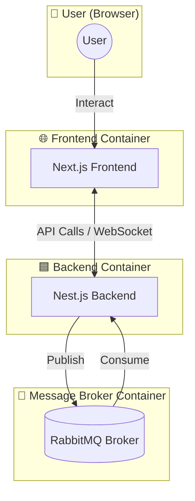

# Deployment Doc

## Table of contents
- [Overview](#overview)
- [Prerequisites](#prerequisites)
- [Deployment Steps](#deployment-steps)


## Overview 
โปรเจกต์ (Rock Paper Scissors) นี้ประกอบด้วย 3 services:

- **Frontend (Next.js)** – ใช้สำหรับ UI/UX  
- **Backend (Nest.js)** – REST API  
- **RabbitMQ** – Message Broker  

ทั้งสามจะถูก deploy ผ่าน **Docker Compose**
### Architecture



## Prerequisites
ก่อนจะ deploy ต้องมีสิ่งเหล่านี้ติดตั้งในเครื่อง/เซิร์ฟเวอร์
1. Docker  
2. Docker Compose  
3. Git  


## Deployment Steps

### 1) Clone Project
> **Note:** หากยังไม่ initialize git ในเครื่อง ให้รัน `git init` ก่อน
```bash
git clone https://github.com/march250602/RPS_test.git

```
### 2) แก้ไขไฟล์ `./RockPaperScissors-main/.env`  
(`HostIP-Address` คือ IP address หรือ domain name ของเครื่อง/เซิร์ฟเวอร์)

ไปที่ Directory .\RPS_test\RockPaperScissors-main\
```bash
cd .\RPS_test\RockPaperScissors-main\
```
จากนั้น เปิดไฟล.env และแก้ไข้
```bash
nano .env
```
**Before**
```env
NEXT_PUBLIC_API_URL='http://localhost:4000'
NEXT_PUBLIC_SOCKET_URL='http://localhost:4000'
```
**After**
```env
NEXT_PUBLIC_API_URL='http://<HostIP-Address>:4000'
NEXT_PUBLIC_SOCKET_URL='http://<HostIP-Address>:4000'
```
### 3) แก้ไขไฟล์ ./backend/.env 
(`HostIP-Address` คือ IP address หรือ domain name ของเครื่อง/เซิร์ฟเวอร์)

ไปที่ Directory .\RPS_test\backend\
```bash
cd .\RPS_test\backend\ (หากคุณ อยู่ root)
or
cd ..\backend (หากคุณ อยู่ folder ./RockPaperScissors-main/)
```
จากนั้น เปิดไฟล.env และแก้ไข้
```bash
nano .env
```
**Before**
```env
Frontend=http://localhost:3000
```
**After**
```env
Frontend=http://<HostIP-Address>:3000
```


### 4) run docker compose
รัน Docker compose ที่ directory ./RPS_test/
```bash
sudo docker-compose -f docker-compose.yml up -d --build
```
### 5)เปิด Browser 
ไปที่
👉 http://`<HostIP-Address>`:3000 
> **Note:** หากเข้าไม่ได้ อาจติด Firewall → ต้องเปิดพอร์ตต่อไปนี้:

> - Port:3000 (Frontend)

> - Port:4000 (Backend)

> - Port:5672 และ Port:15672 (RabbitMQ Management)


## API Testing Scripts (Postman)

### 1️⃣ GET `/api/get-score`
**Purpose:** ดึง high score  

**Postman Test Script (Tests Tab)**

```javascript
pm.test("Status code is 200", function () {
    pm.response.to.have.status(200);
});

pm.test("Response has score not NULL", function () {
    const jsonData = pm.response.json();
    pm.expect(jsonData).to.have.property("score");
    pm.expect(jsonData.score).to.be.a("number");
});
```

### GET `/api/bot-choice`
**Purpose:** ดึง bot choice แบบสุ่ม  

**Postman Test Script (Tests Tab)**

```javascript

pm.test("Status code is 200", function () {
    pm.response.to.have.status(200);
});


pm.test("Response has choice and timestamp", function () {
    const jsonData = pm.response.json();

    // ต้องมี property choice และ timestamp
    pm.expect(jsonData).to.have.property("choice");
    pm.expect(["paper", "scissors", "rock"]).to.include(jsonData.choice);

    pm.expect(jsonData).to.have.property("timestamp");
});

```


### POST `/api/update-score`
**Purpose:** อัปเดตคะแนน highScore  

**Body (raw JSON)**
```json
{
    "score": 50
}
```
```javascript
pm.test("Status code is 201", function () {
    pm.response.to.have.status(201);
});


pm.test("Response has 'res' property", function () {
    const jsonData = pm.response.json();

    pm.expect(jsonData).to.have.property("res");
    pm.expect(jsonData.res).to.be.a("string");

    
    pm.expect(["successfully updated", "no update needed"]).to.include(jsonData.res);

    console.log("API Response:", jsonData.res);
});


pm.test("highScore should be number if available", function () {
    const jsonData = pm.response.json();

    if (jsonData.result && jsonData.result.highScore !== undefined) {
        pm.expect(jsonData.result.highScore).to.be.a("number");
    }
});
