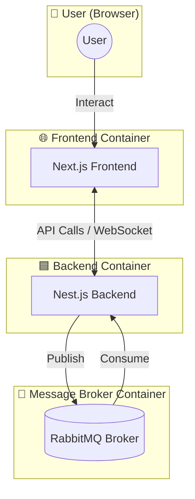

# Deployment Doc

## Table of contents
- [Overview](#overview)
- [Prerequisites](#prerequisites)
- [Deployment Steps](#deployment-steps)


## Overview 
โปรเจกต์ (Rock Paper Scissors) นี้ประกอบด้วย 3 services:

- **Frontend (Next.js)** – ใช้สำหรับ UI/UX  
- **Backend (Nest.js)** – REST API  
- **RabbitMQ** – Message Broker  

ทั้งสามจะถูก deploy ผ่าน **Docker Compose**
### Architecture



## Prerequisites
ก่อนจะ deploy ต้องมีสิ่งเหล่านี้ติดตั้งในเครื่อง/เซิร์ฟเวอร์
1. Docker  
2. Docker Compose  
3. Git  


## Deployment Steps

### 1) Clone Project
> **Note:** หากยังไม่ initialize git ในเครื่อง ให้รัน `git init` ก่อน
```bash
git clone https://github.com/march250602/RPS_test.git

```
### 2) แก้ไขไฟล์ `./RockPaperScissors-main/.env`  
(`HostIP-Address` คือ IP address หรือ domain name ของเครื่อง/เซิร์ฟเวอร์)

**Before**
```env
NEXT_PUBLIC_API_URL='http://localhost:4000'
NEXT_PUBLIC_SOCKET_URL='http://localhost:4000'
```
**After**
```env
NEXT_PUBLIC_API_URL='http://<HostIP-Address>:4000'
NEXT_PUBLIC_SOCKET_URL='http://<HostIP-Address>:4000'
```
### 3) แก้ไขไฟล์ ./backend/.env 
(`HostIP-Address` คือ IP address หรือ domain name ของเครื่อง/เซิร์ฟเวอร์)
```bash
cd .\RPS_test\RockPaperScissors-main\
```bash
จากนั้น เปิดไฟล.env ด้วย
```bash
nano .env
```bash
**Before**
```env
Frontend=http://localhost:3000
```
**After**
```env
Frontend=http://<HostIP-Address>:3000
```


### 4) run docker compose
รัน Docker compose ที่ directory ./RPS_test/
```bash
sudo docker-compose -f docker-compose.yml up -d --build
```
### 5)เปิด Browser 
ไปที่
👉 http://`<HostIP-Address>`:3000 
> **Note:** หากเข้าไม่ได้ อาจติด Firewall → ต้องเปิดพอร์ตต่อไปนี้:

> - Port:3000 (Frontend)

> - Port:4000 (Backend)

> - Port:5672 และ Port:15672 (RabbitMQ Management)
